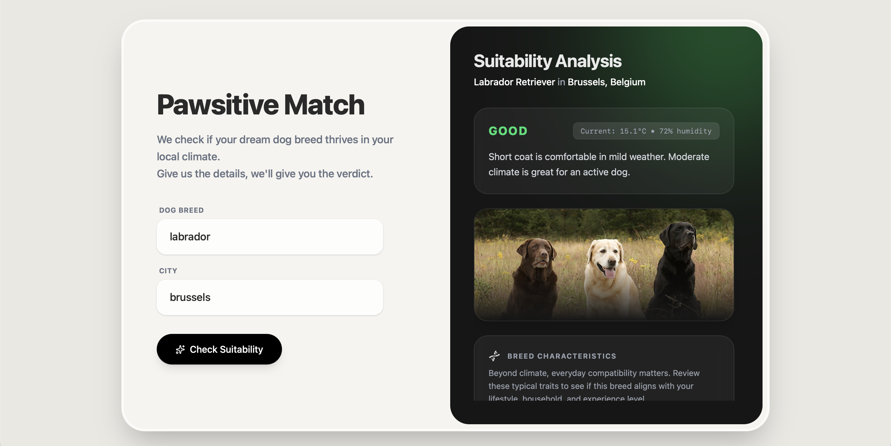
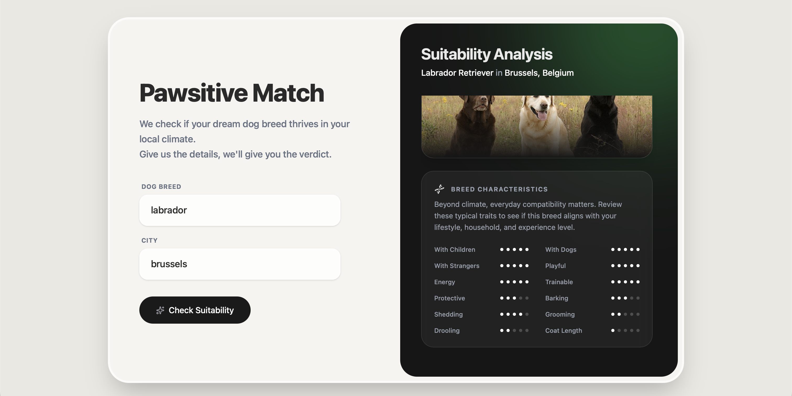
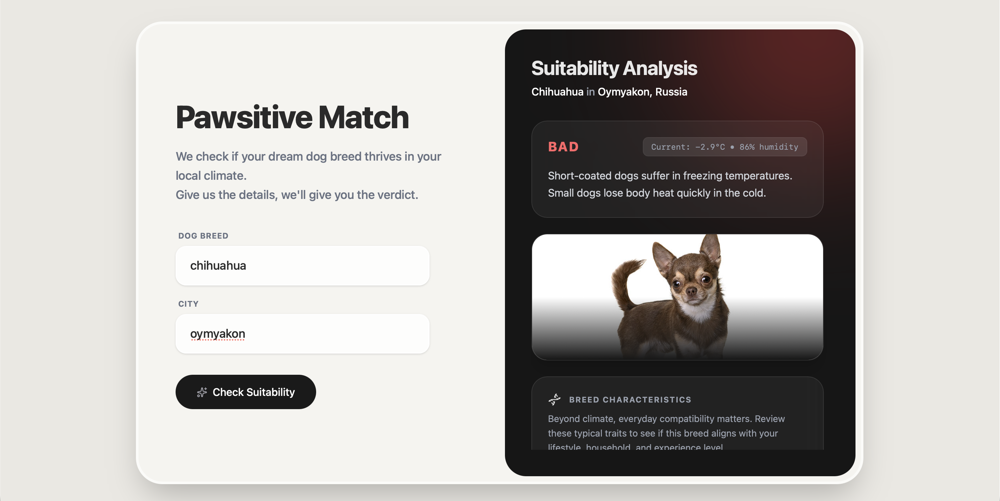

# Dog Suitability Checker

## About

A school project built to learn **microservice architecture** with **Quarkus**, **asynchronous messaging** (AMQP/Artemis), **external API integration**, **fault tolerance patterns**, and **containerization** with Docker Compose.

## What It Does

The system checks whether a dog breed is suitable for the current weather in a given city. Submit a breed and city, and the system fetches real-time weather data and breed characteristics to evaluate suitability using a scoring-based algorithm, returning a verdict of GOOD, MODERATE, or BAD.

## Screenshots





## Key Concepts

- Splitting a system into separate microservices communicating via message queues
- Async request/response pattern with status polling
- MicroProfile REST Client for external API calls
- Fault tolerance (retry, timeout, circuit breaker, fallback)
- Health checks and Prometheus metrics
- Multi-stage Docker builds and Docker Compose orchestration

## Architecture

```
[Frontend (React)]
       |
       | POST /check, GET /status, GET /result
       v
[dog-checker-api]  ──── PostgreSQL
       |  ^
       |  | (listens to response queue, updates DB)
       |  |
       | sends to "check-request" queue
       v
[Artemis Message Broker]
       |
       | delivers from "check-request" queue
       v
[dog-checker-worker]
       |── calls Dogs API   (api.api-ninjas.com)
       |── calls Weather API (weatherapi.com)
       |── evaluates suitability
       |
       | sends to "check-response" queue
       v
[Artemis Message Broker] → [dog-checker-api] → [PostgreSQL]
```

## Tech Stack

| Layer           | Technology                              |
|-----------------|----------------------------------------|
| Framework       | Quarkus 3.x (Java 21)                  |
| REST            | RESTEasy Classic + Jackson              |
| ORM             | Hibernate ORM with Panache              |
| Database        | PostgreSQL                              |
| Messaging       | SmallRye Reactive Messaging + AMQP (Artemis) |
| HTTP Client     | MicroProfile REST Client                |
| Fault Tolerance | SmallRye Fault Tolerance (Retry, Timeout, CircuitBreaker, Fallback) |
| Health          | SmallRye Health                         |
| Metrics         | Micrometer + Prometheus                 |
| Frontend        | React (Vite)                            |
| Containerization| Docker + Docker Compose                 |

## Project Structure

```
dog-suitability-checker/
├── docker-compose.yml          ← Infrastructure + all services
├── dog-checker-api/            ← REST API + database + messaging
├── dog-checker-worker/         ← Background worker + external API calls
└── dog-checker-frontend/       ← React frontend
```

## Request Flow

1. User submits a breed and city via the frontend
2. The API creates a `DogWeatherRequest` entity with status `PENDING` and saves it to PostgreSQL
3. The API sends a message to the `check-request` queue on Artemis
4. The frontend starts polling `GET /status/{id}` every 2 seconds
5. The worker picks up the message and calls the Dogs API and Weather API
6. The worker runs the suitability scoring algorithm and sends the result to the `check-response` queue
7. The API receives the response, updates the database record to `DONE` (or `FAILED`)
8. The frontend's next poll sees the final status, fetches the full result via `GET /result/{id}`, and displays it

## External APIs

The worker calls two external APIs using MicroProfile REST Client:

- **Dogs API** (`api.api-ninjas.com/v1/dogs`) — returns breed characteristics like coat length, energy level, weight, and an image. Fuzzy-matches breed names (e.g. "lab" → "Labrador Retriever").
- **Weather API** (`weatherapi.com/v1/current.json`) — returns current temperature, humidity, and condition for a city. Also fuzzy-matches city names (e.g. "brus" → "Brussels, Belgium").

The matched names are stored and returned to the user so they can see exactly what the APIs resolved their input to.

## Suitability Scoring

The suitability verdict is determined by a point-based scoring system rather than simple if/else rules. It combines breed characteristics (coat length, energy level, weight) from the **Dogs API** with live weather data (temperature, humidity) from the **Weather API**. Each factor adds or subtracts points, and the total score determines the result:

| Factor | Condition | Points |
|--------|-----------|--------|
| Coat + Heat | Thick coat (≥3) in extreme heat (>30°C) | -3 |
| Coat + Heat | Thick coat in warm weather (>25°C) | -2 |
| Coat + Cold | Short coat (≤2) in freezing temps (<0°C) | -3 |
| Coat + Cold | Short coat in cold weather (<5°C) | -2 |
| Coat + Cool | Thick coat in cool weather (5–20°C) | +2 |
| Coat + Mild | Short coat in mild weather (10–25°C) | +1 |
| Energy + Climate | High energy (≥4) in moderate climate (5–20°C) | +2 |
| Energy + Heat | High energy in extreme heat (>30°C) | -2 |
| Energy + Warm | High energy in warm weather (>25°C) | -1 |
| Energy + Comfort | Low energy (≤2) in comfortable temps (10–25°C) | +1 |
| Humidity | High humidity (>80%) + heat (>25°C) | -2 |
| Humidity | Moderate humidity (>70%) + warm (>25°C) | -1 |
| Weight + Heat | Large dog (>40 lbs) in warm weather (>25°C) | -1 |
| Weight + Cold | Small dog (<10 lbs) in cold weather (<5°C) | -1 |

**Verdict:** score ≥ 2 → GOOD, score ≤ -2 → BAD, anything in between → MODERATE.

Multiple factors can stack, so a thick-coated, high-energy large dog in hot humid weather would score very poorly.

## Resiliency

Both external API calls are wrapped with SmallRye Fault Tolerance annotations:

| Pattern | Config | Purpose |
|---------|--------|---------|
| `@Timeout` | 5 seconds | Prevents hanging if an API is slow |
| `@Retry` | 3 retries, 1s delay | Handles transient network failures |
| `@CircuitBreaker` | Opens after 3/4 failures, 10s cooldown | Stops hammering a down API |
| `@Fallback` | Returns `null` | Lets the worker respond with `FAILED` + reason instead of crashing |

## API Endpoints

### POST /check
Submit a suitability check request.
```bash
curl -X POST http://localhost:8080/check \
  -H "Content-Type: application/json" \
  -d '{"breed": "labrador", "city": "Brussels"}'
```
Response: `{"id": 1, "status": "PENDING"}`

### GET /status/{id}
Check the status of a request.
```bash
curl http://localhost:8080/status/1
```
Response: `{"id": 1, "status": "PENDING|DONE|FAILED"}`

### GET /result/{id}
Get the full result (only available when status is DONE or FAILED).
```bash
curl http://localhost:8080/result/1
```
Response:
```json
{
  "id": 1,
  "breed": "labrador",
  "city": "Brussels",
  "status": "DONE",
  "suitability": "GOOD",
  "reason": "Thick coat is well suited for cool weather. Moderate climate is great for an active dog.",
  "matchedBreed": "Labrador Retriever",
  "matchedCity": "Brussels, Belgium",
  "temperature": 12.4,
  "humidity": 71,
  "breedInfo": {
    "imageLink": "https://api-ninjas.com/images/dogs/labrador_retriever.jpg",
    "goodWithChildren": 5,
    "goodWithOtherDogs": 5,
    "goodWithStrangers": 5,
    "shedding": 4,
    "grooming": 2,
    "drooling": 2,
    "coatLength": 1,
    "playfulness": 5,
    "protectiveness": 3,
    "trainability": 5,
    "energy": 5,
    "barking": 3
  }
}
```

## Observability

| Endpoint              | Service | Description          |
|-----------------------|---------|----------------------|
| `GET /q/health`       | API     | Database connectivity check |
| `GET /q/health`       | Worker  | API key configuration check (Dogs API + Weather API) |
| `GET /q/metrics`      | API     | Prometheus metrics — includes `dog_checks_received_total` (number of check requests submitted) |
| `GET /q/metrics`      | Worker  | Prometheus metrics — includes `dog_checks_processed_total` (checks completed, tagged by suitability verdict) |

- API health/metrics: http://localhost:8080/q/health, http://localhost:8080/q/metrics
- Worker health/metrics: http://localhost:8081/q/health, http://localhost:8081/q/metrics

## Error Handling

| Scenario | Response |
|----------|----------|
| Blank breed or city on `POST /check` | 400 Bad Request |
| ID not found on `GET /status` or `GET /result` | 404 Not Found |
| Result not ready (`GET /result` while still processing) | 409 Conflict |
| Breed not found by Dogs API | Status `FAILED`, reason: "Dog breed '{breed}' not found." |
| City not found by Weather API | Status `FAILED`, reason: "City '{city}' not found." |
| External API down (after retries + fallback) | Status `FAILED` with explanation |

## Prerequisites

- **Docker** and **Docker Compose**
- **JDK 21** (for dev mode)
- **Node.js 18+** (for frontend dev mode)
- **API Keys:**
  - Dogs API key from [api-ninjas.com](https://api-ninjas.com)
  - Weather API key from [weatherapi.com](https://www.weatherapi.com)

## API Keys Setup

Create a `.env` file in the `dog-checker-worker/` directory:

```
DOGS_API_KEY=your_api_ninjas_key_here
WEATHER_API_KEY=your_weather_api_key_here
```

## Running

### Production Mode (Docker)

Builds everything from source and runs it in containers — no pre-build needed:

```bash
docker compose up --build
```

- Frontend: http://localhost:5173
- API: http://localhost:8080
- Artemis Admin UI: http://localhost:8161 (artemis/artemis)

### Dev Mode

Dev mode gives you hot reload for both backend and frontend.

1. Start infrastructure:
   ```bash
   docker compose up -d artemis postgres
   ```

2. Start the API (new terminal):
   ```bash
   cd dog-checker-api
   ./mvnw quarkus:dev
   ```

3. Start the worker (new terminal):
   ```bash
   cd dog-checker-worker
   ./mvnw quarkus:dev
   ```

4. Start the frontend (new terminal):
   ```bash
   cd dog-checker-frontend
   npm run dev
   ```

- Frontend: http://localhost:5173
- API: http://localhost:8080
